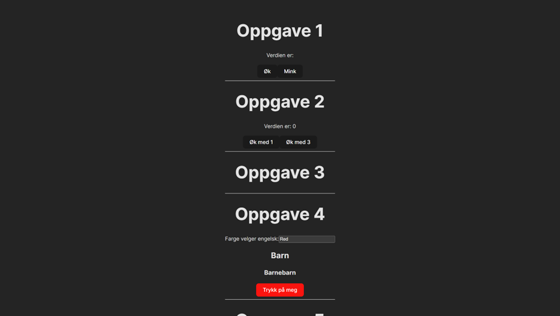

# React hooks kurs med Bredvid!

Velkommen til kurs om React hooks med Bredvid!

## Forberedelser

- [Git](https://git-scm.com/)
- [Node.js](https://nodejs.org/en)
- IDE egnet for webutvikling (vi bruker [Visual Studio Code](https://code.visualstudio.com/))

## Laste ned prosjektet

I terminalen velg den mappen du ønsker å laste ned prosjektet i

`git clone link-til-kurset`

`cd react-hooks-kurs`

## Kjøre prosjektet

I terminalen kjør:

`npm install`

deretter:

`npm run dev`

Åpne linken som står etter "--> Local: "

Siden bør se cirka slik ut:

## Oppgaver

Oppgavene finner man under "src/Oppgaver"

## Dokumentasjon

Noen sider som kan være til hjelp:

- [Den nye React dokumentasjonen](https://react.dev/reference/react)
- [Den gamle React dokumentasjonen](https://legacy.reactjs.org/docs/hooks-intro.html)

## Fasit

Fasit finner man ved å kjøre disse kommandoene i terminalen:

- `git checkout fasit_1`
- `git checkout fasit_2`
- `git checkout fasit_3`
- `git checkout fasit_4`
- `git checkout fasit_5`
